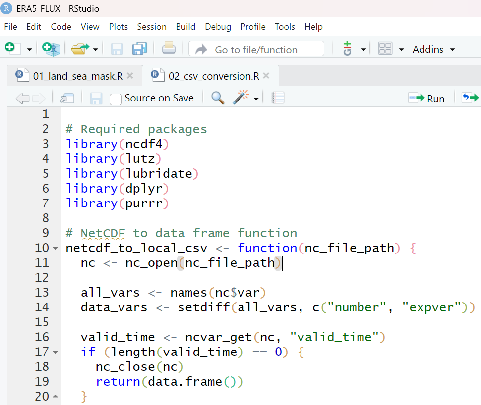
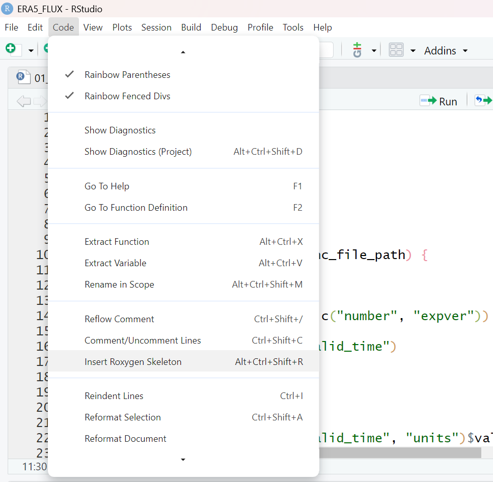
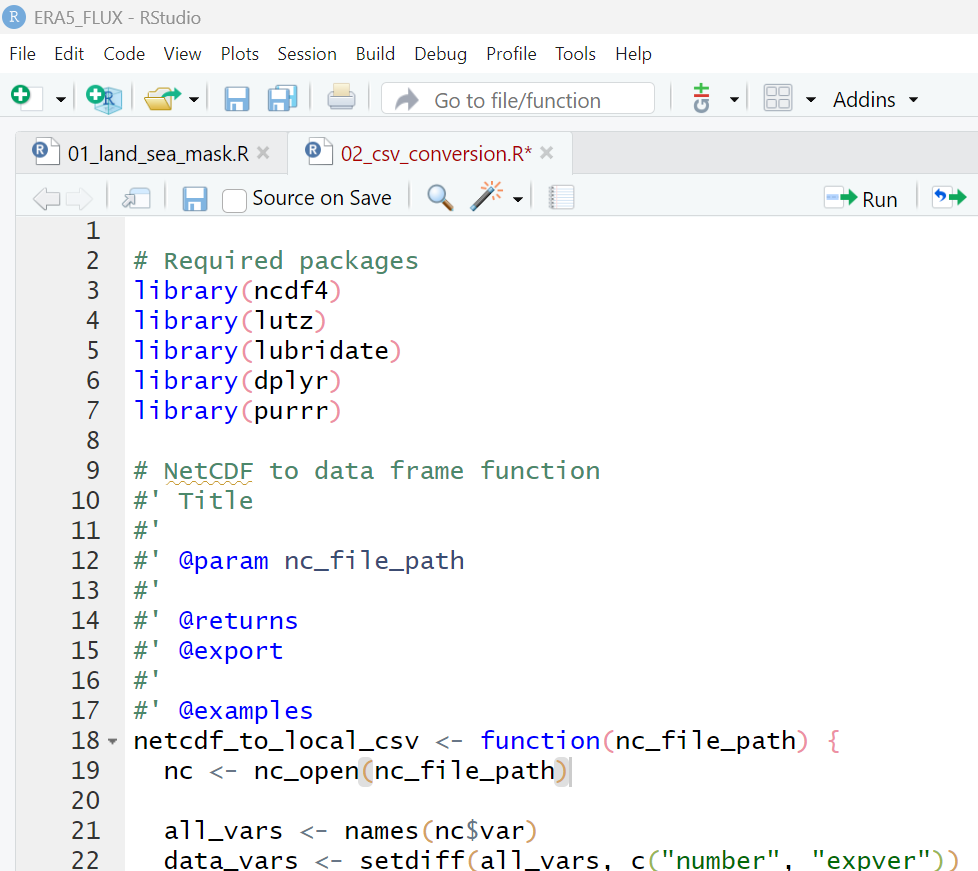

<!-- README.md is generated from README.Rmd. Please edit that file -->

# ERA5Flux

<!-- badges: start -->
<!-- badges: end -->

The primary objective of this repo is to improve the utility of ERA5
data at flux site locations.

Scripts are organized into the following groups

# 1. create df.sitemetadata file 00_sitemetadata

- df that contains site meta data (site code, lat, lon, start date, end
  data, variables needed)

# 2. pre-Download for Files \_01

- day_padding (add 1 day to start and end dates for future time zone
  offset issues)
- utc_offset (add UTC offset to df.sitemetadata)
- get_land_proportion (pull land-sea_mask for one day)
- 01_ERA5_API (use ecmwfr package with df.sitemetadata)

# ***DATA is Downloaded***

# 3. Data Processing for ERA5 \_02

02_csv_conversion: Takes directory as an argument and reformats ERA4 .nc
data into csv format with the following characteristics.

- Uses two functions to reformat netcdf data:
  - netcdf_df_formatter(nc_file_path)
    - Input: (character) file path to a folder containing the netcdf
      files of one site.
    - Output: (dataframe) of the characteristics:
      - Datetime stamp column named “time”.
      - UTC timezones convetered to local time.
      - Time column formatted as yyyyMMddHHmm
      - Variables names from ERA5 dataset maintained
      - ERA5 units converted to Ameriflux units:
      - Solar radiation (ssrd) from Jm-2 to Wm-2.
      - Air Temperature (t2m) from Kelvin to celsius.
      - Total precipitation (tp) from meters to millimeters.
  - netcdf_to_csv(site_folder)
    - Input: (character) file path to a folder containing the netcdf
      files of one site.
    - Output: .csv file of netcdf data within site_folder.
      - The .csv file is located within the site_folder and has the file
        name format: siteID_startYear_endYear_variableName.csv For
        example, US-Ho1_2001_2020_tp_t2m.csv
      - SiteID is deetermined from lat and lon coordinates in
        df.sitemetadata.
      - Each csv file starts from the first hour of a year (e.g.,
        2000-01-01 00:00) and ends with the last hour of a year (e.g.,
        2020-12-31 23:00).

# 4. Flux Data Merging_03

- Two functions to merge and blend ERA5 and FLUX data
  - 03A_merge_ERA5_Flux: do interpolation of ERA5 data to ensure ERA5
    and FLUX datasets share the same timestamp.  
  - 03B_blend_ERA5_Flux: blend ERA5 and FLUX datasets according to
    blending rules.
- Input and output variables of the two functions
  - input variables (character): filename_FLUX, filename_ERA5
  - input variables (vector of character): varname_FLUX, varname_ERA5
  - input variables (vector of character): blending_rules
  - output variables: a dataframe with the original ERA5 and FLUX data
    and gap-filled data for each varname
- Requirement of these input variables
  - varname_FLUX and varname_ERA5 should have the same length. These
    names of the same row should be matched.
  - blending_rules should have the same length with varname_FLUX and
    varname_ERA5. users should give rules for each variable.
  - options for blending_rules: “replace”, “lm”, “lm_no_intercept”,
    “automatic”

\*scripts are provided for both python and R.

## Function Documentation

**Step 0:** Enter into developer mode by running `library(devtools)` and
then `devtools::load_all()` to make your functions available for
developing.

**Step 1:** Click to anywhere inside your function.



**Step 2:** Go to Code -\> Insert Roxygen Skeleton. This will populate
your script with some template roxygen comments.



**Step 3:** Fill out the template roxygen comments. You can learn more
about what to write in these comments
[here](https://r-pkgs.org/man.html). Or you can view the [function
documentation in
CarbonExchangeParameters](https://github.com/Malone-Disturbance-Ecology-Lab/CarbonExchangeParameters/tree/main/R)
as an example. Do not put anything under “@export”.



Notes: If you have sample data that you would like to use in your
function examples, you can put them under `inst/extdata/`. Then you can
reference your sample data with something like
`system.file("extdata", "your-file.nc", package = "ERA5Flux")`. For
functions that export a file, you will need to make sure to have a
function argument that lets the user specify where they would like to
export the file output. Then in the function example, you can just make
the example export to a temporary folder with `tempdir()`. This is
because CRAN does not allow functions that export something without
letting the user decide where it goes. See `netcdf_to_csv()` for an
example.

**Step 4:** Make sure your updated function script is under the “R”
folder. Now render the documentation into an actual help page for the
function using `devtools::document()`. This will generate a .Rd file
inside the “man” folder. This becomes your function’s help page and you
can now access it by typing `?your-function-name`.

**Step 5:** Always remember to push your commits to GitHub!

## Installation

You can install the development version of ERA5Flux from
[GitHub](https://github.com/) with:

``` r
# install.packages("pak")
pak::pak("Malone-Disturbance-Ecology-Lab/ERA5Flux")
```
