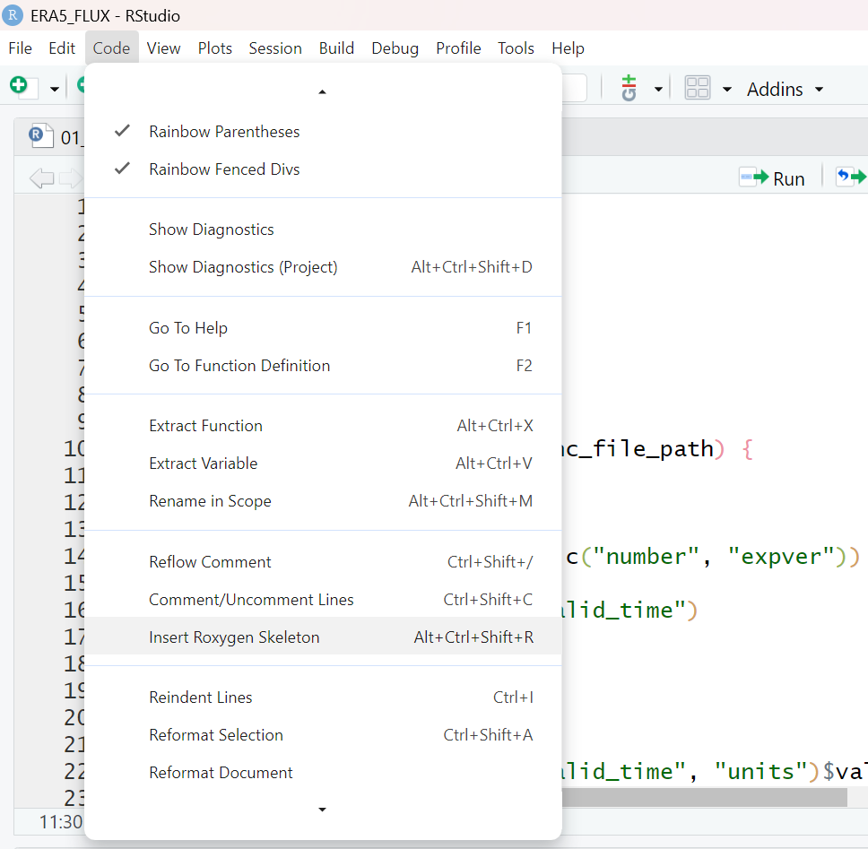
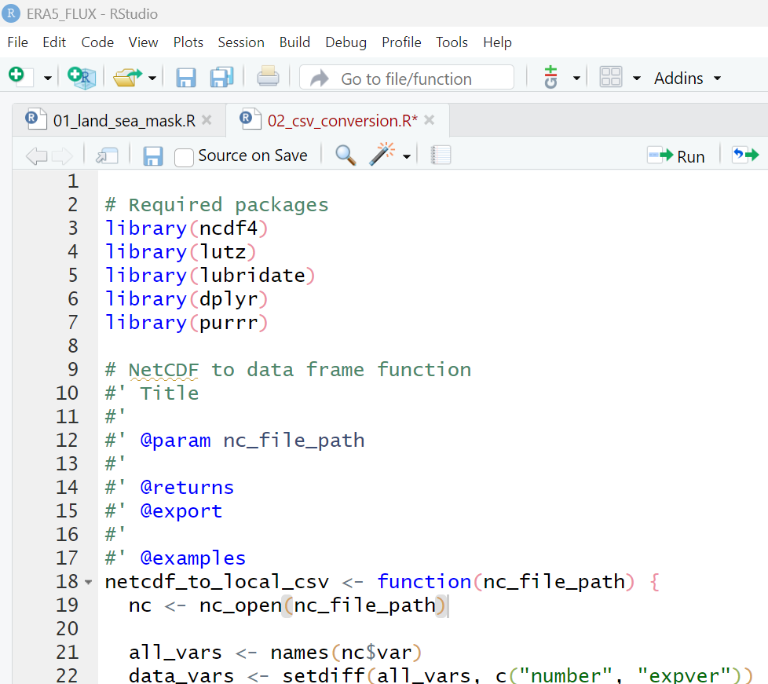

# ERA5_FLUX

The primary objective of this repo is to improve the utility of ERA5 data at flux site locations. 

Scripts are organized into the following groups
# 1. create df.sitemetadata file 00_sitemetadata
- df that contains site meta data (site code, lat, lon, start date, end data, variables needed)
# 2. pre-Download for Files _01
- 01_start_end_time_padding (add 1 day to start and end dates for future time zone offset issues)
- 01_lat_lon_UTC_offset (add UTC offset to df.sitemetadata)
- 01_point_sample_check (pull land-sea_mask for one day)
- 01_ERA5_API (use ecmwfr package with df.sitemetadata)
  
# ***DATA is Downloaded***

# 3. Data Processing for ERA5 _02

02_csv_conversion: Takes directory as an argument and reformats ERA4 .nc data into csv format with the following characteristics.
- Uses two functions to reformat netcdf data:
    - netcdf_df_formatter(nc_file_path)
        - Input: (character) file path to a folder containing the netcdf files of one site.
        - Output: (dataframe) of the characteristics:
          - Datetime stamp column named "time".
          - UTC timezones convetered to local time.
          - Time column formatted as yyyyMMddHHmm
          - Variables names from ERA5 dataset maintained
          - ERA5 units converted to Ameriflux units:
          - Solar radiation (ssrd) from Jm-2 to Wm-2.
          - Air Temperature (t2m) from Kelvin to celsius.
          - Total precipitation (tp) from meters to millimeters.
  
    - netcdf_to_csv(site_folder)
        - Input: (character) file path to a folder containing the netcdf files of one site.
        - Output: .csv file of netcdf data within site_folder.
            - The .csv file is located within the site_folder and has the file name format: siteID_startYear_endYear_variableName.csv For example, US-Ho1_2001_2020_tp_t2m.csv
            - SiteID is deetermined from lat and lon coordinates in df.sitemetadata.
            - Each csv file starts from the first hour of a year (e.g., 2000-01-01 00:00) and ends with the last hour of a year (e.g., 2020-12-31 23:00). 

# 4. Flux Data Merging_03
- Two functions to merge and blend ERA5 and FLUX data
  - 03_01_merge_ERA5_FLUX: do interpolation of ERA5 data to ensure ERA5 and FLUX datasets share the same timestamp.  
  - 03_02_blend_ERA5_FLUX: blend ERA5 and FLUX datasets according to blending rules.
- Input and output variables of the two functions
  - input variables (character): filename_FLUX, filename_ERA5
  - input variables (vector of character): varname_FLUX, varname_ERA5
  - input variables (vector of character): blending_rules
  - output variables: a dataframe with the original ERA5 and FLUX data and gap-filled data for each varname
- Requirement of these input variables
  - varname_FLUX and varname_ERA5 should have the same length. These names of the same row should be matched.
  - blending_rules should have the same length with varname_FLUX and varname_ERA5. users should give rules for each variable.
  - options for blending_rules: "replace", "lm", "lm_no_intercept", "automatic"

*scripts are provided for both python and R.

## Function Documentation

**Step 1:** Click to anywhere inside your function.

**Step 2:** Go to Code -> Insert Roxygen Skeleton. This will populate your script with some template roxygen comments.

**Step 3:** Fill out the template roxygen comments. You can learn more about what to write in these comments [here](https://r-pkgs.org/man.html). Or you can view the [function documentation in CarbonExchangeParameters](https://github.com/Malone-Disturbance-Ecology-Lab/CarbonExchangeParameters/tree/main/R) as an example. Do not put anything under "\@export".

**Step 4:** Done! Normally you would render the documentation into an actual help page for the function using `devtools::document()` but this repo does not have the required package infrastructure yet, so `devtools::document()` will error out. 
